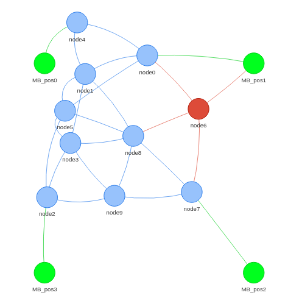

# Bluetooth Dijkstra Pathfinder

[](https://opensource.antmicro.com)

This repository contains project files of custom Bluetooth mesh
implementation for nRF52840, with Dijkstra's algorithm as routing algorithm. Application
is based on Zephyr RTOS and it's BLE stack and it was tested with Renode in
multinode configurations.

Proposed solution tries to extend possibilities of standard BLE mesh, that is based
on principle of flooding and is not suitable for data transfer, but rather for
simple state propagation.

Project, apart from main application, also contains bunch of helper utilities,
that ease the development:
* Mobile broadcaster application, it is simplified advertising node, that initiates the transmission.
* build\_as.sh script for building the application in multiple configurations.
* Ready to use .resc files for Renode testing.
* Generator script, that will take a .json file with provided topology and initialize in code initial routing table (or graph) and generate a thread safe API to access it.
* Randomizer script that will "reshuffle" nodes and visualize the output.
* Few robot tests.
* Renode command, extended with Python, that will move the mobile broadcaster.

## Dependencies

### Zephyr RTOS
The application is based on Zephyr RTOS in version 2.7.99 so it should be installed
according to [documentation](https://docs.zephyrproject.org/2.7.0/getting_started/index.html).

### Renode
Application is tested using very convinient Renode multinode simulation. To install
renode, follow the guide on official [github site](https://github.com/renode/renode).

### Python dependencies
Few utilities are used for generator and randomizer scripts. Install them with following:
```
pip install Jinja2==2.11.3
pip install pyvis
```

## Build the application
To build the application, use the build\_as.sh script. When in doubt on how to
use it, run `./build_as.sh` without any options to display help and example
usage. There are few configurations to choose from:

### Build as basic 5 nodes
This configuration is suitable for development, as it is constant, it has simple
to understand paths. Few features of this configuration:
* Packets are sent by mobile broadcaster and are all adressed to node 0 (sink).
* Node 3 is node that is not reserved, it is an address in the mesh that is not used.
* Node 4 represents inactive node, it is included in the mesh topology, but it is not added to Renode simulation, so it will not receive or ACK any packets. This will force neighbors, to adjust the path.
* Mobile broadcaster is moving on the corners of 500x500 rectangle, at one time it is in range of two nodes simultaneously.

Below is presented visualization of that configuration:


To build and run the application in this configuration, run the following commands:
```bash
$ ./build_as.sh -b
$ renode config-files/mesh-topology-desc/basic_5_nodes.json
```

We expect that node 2 will try to send to node 4, as path through node 4 is the
shortest path to node 0. It will try to send the messages, but will never receive
an ACK, which will increase a cost of transition to that node. When the cost will
be high enough, Dijkstra's algorithm will start routing the packets in different
way and node 4 will be bypassed.

There is also a robot test, that will automatically test above scenario. To run
it issue following command:
```bash
renode-test tests/test_dijkstra_path_finding.robot
```

It will check path calculation and also path replanning in case when the peer
node (node 4) is not acknowledging the messages.

### Randomized
This configuration is suitable for testing bigger meshes and testing overall
performance of the network. It will generate a topology .json file with randomly
placed nodes on 500x500 grid. Depending on the number of nodes, the radio range
will be adjusted. This build will also be visualized by pyvis in output .html file.
This is used for user validation of path finding. Few features of this build:
* There is always 1 inactive node, node 0 can not be inactive.
* User can specify number of nodes to generate.
* Radio range is adjusted to accomodate for different number of nodes on the grid.
* Mobile broadcaster will move on the corners of 500x500 square.
* It is not always guaranteed, that the randomized topology will have a valid path to destination node, so check that with visualization.
* Packets are initially sent from mobile broadcaster and are addressed by default to node 0.

Example visualization of randomized topology from pyvis:



**Note 1**: nodes in the visualization are not placed in their exact coordinates, but
rather they are more or less placed and the pyvis adds physics, so they
attract / repel each other. This allows for better visualization but does not
give exact positions. On the other hand, mobile broadcaster is positioned in
exact x, y coordinates.

**Note 2**: to see transition cost between nodes, hover Your mouse over the edge.

To build and run the application in this configuration, run the following commands:
```bash
# Use the -s option to reshuffle nodes, or if You run that build for a first time, generate a new topology .json file.
$ ./build_as.sh -r -s <number of nodes>

# Output .resc file is under following path
$ renode config-files/renode-resc-files/randomized_topology.resc
```

### Custom configuration
The build\_as.sh script can be used with custom topology, declared as a valid .json.
For examples on how to prepare such file, refer to config-files/mesh-topology-desc.
There You will find proper topology descriptions. You will also have to pair topology
file with .resc file (examples in config-files/renode-resc-files) and such
combination can be build and run with:

```bash
# Provide topology json file
$ ./build_as.sh -i example.json

# Run the simulation with your .resc files
$ renode config-files/renode-resc-files/your_resc_file.resc
```

The topology file should be placed in config-files/renode-resc-files, as the
script will search in that directory for file with given name.

## Configuration files

### Renode's .resc files
Contained in config-files/renode-resc-files they describe the topology in Renode
simulation. This file will describe each node involved in the network:
* It's hardware with .repl file
* Radio and radio range
* Physical position of the node in X, Y, Z
* Identification address (default BLE identity of the device)
* Analyzers connected to it
* Binaries associated with that node
* etc, for more refer to examples in config-files/renode-resc-files or [Renode documentation](https://renode.readthedocs.io/en/latest/)

### Topology .json files
Contained in config-files/mesh-topology-desc directory, they are used to:
* Define positions of the node on X, Y plane
* Define the BLE address of the device
* Define paths connecting the device with neighbors
* Each path contains information about the mesh ID of the neighbor, transition cost (can be zero it will be calculated later), factors i.e. properties taken into account when calculating transition cost for Dijkstra's algorithm (signal strength, physical distance, number of missed transmissions) and weight of each of those factors

Examples are in config-files/mesh-topology-desc.

### Mobile broadcaster paths .json files
Contained in config-files/mb-paths, are very simple files containing consequent positions of mobile broadcaster
during the simulation. Such files are loaded by a Renode's command added with Python (see scripts/renode\_commands.py).
This file is basically an array of pairs of values, representing consequent X, Y coordinates of the mobile broadcaster.

## Utility scripts
Few scripts are included to help with development and support build process:
* generator.py - script that will take as an input a .json with topology description and generate .c and .h files for the application with description of graph / mesh and thread safe API for accessing fields of this data structure.
* topology\_randomizer.py - script that will generate random topology and output a .json, .resc files with the topology and also .html file with visualization.
* renode\_commands - script with 2 commands for Renode, to allow moving a mobile broadcaster and loading it's path.

## Communication scheme
Nodes have a 3 ways of communicating with each other:
* Data transmission - BLE packet with a data to be propagated to the receiver.
* Data acknowledge (ACK) - each data transmission must be ACK'ed by the receiver, so that transmitter will deem it responsive and will not increase the cost of transition to it.
* Routing table record propagation - in contrary to previous types, this type of message is not directed to certain peer, but rather broadcasted to everyone that listens and should be rebroadcasted as many times as the TTL (time to live) field specifies. This type of message contains current node's neighbors and connections to them with transition costs and will be loaded to internal topology representation.

Each of this tasks is handled by separate thread.


