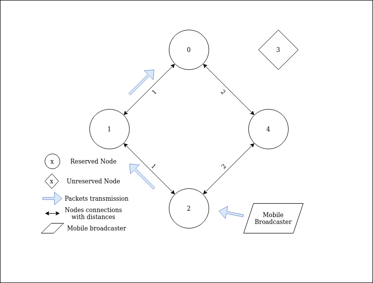

### PZIE: didn't read, sorry. But I think we can have our graphics team redraw the images
### PZIE: also please look into our repositories that have the antmicro open source badge - prepare your readme in a similar way
# Bluetooth Dijkstra Pathfinder 
This repository contains project files of custom Bluetooth ad - hoc mesh 
implementation, with Dijkstra's as routing algorithm.

In folder dijkstra\_shortest\_path is my implementation of Dijkstra's shortest 
path algorithm. It does work, although there is still a lot of room for improvements. 
Algorithm was tested on examplary graph: 


In folder zephyr\_project You can find Zephyr project files. Destination platform
of this project is nRF52840 Dongle with Zephyr RTOS. For now it is tested on 
Renode platform.


Default Dijkstra graph used in zephyr version is:

In brackets are distances between nodes and without brackets are nodes addresses. 
This information is contained in graph.c file in initialization function.
This setup allows for simplest case where shortest path must be found. Solution to reach
node 2 from node 0 is path through 0, 1, 2 with total distance of 2.

### Short description of a demo 
It is possible to easily build project in 2 essential configurations, one 
is basic 5 node configuration on which most of the development was performed 
and another is a randomized configuration where user specifies a number of nodes
that will be in the mesh and script randomizes it and builds the application.

In both configurations there is mobile broadcaster that is not a part of the 
mesh, but it initiates a communication. The message from this broadcaster is 
directed to node with mesh id = 2. It is the first recipient of the message in 
both build configurations.

#### Basic 5 node configuration
This configuration consists of 5 nodes in configuration described below that 
create a BLE mesh. 



#### Randomized
In this configuration user has to provide number of nodes that will be
randomized and script will randomize connections between them. Available range 
is from 3 to 64 nodes, although in **current state only up to 9 nodes work in 
simulation.**

### Communication scheme
In current state, communication cycle looks as following:
1. Mobile broadcaster sends a message which is marked with destination - node 0.
Message is directly advertised to node 2. Payload of this message is broadcast 
start time (just zeros).
2. Node 2 after reception, should calculate dijkstra algorithm and decide to 
send the packet to node 1
3. Node 1 executes the same procedure as node 2
4. Message gets to node 0 that is destination of the packet so message is not 
passed anymore.
5. Here begins second cycle of communication, with exactly the same path but
different payload in the message.

### Short description of a packet transmission routine
#### Bluetooth setup description
Bluetooth advertising and scanning is set up in two functions: ble_scan_setup and 
ble_adv_sets_setup. Currently BLE is set to send directed messages, in extended
mode and continously and passively scan for advertisements.

#### Bluetooth packet "passing" routine 
* bt_direct_msg_received_cb - is a callback that fires when node succesfully 
scans a message. Its job is to print to the console that this event happened and 
put that message to a message queue for processing by thread (basically offloading
work from ISR)
* create_packet_thread_entry is a thread responsible for getting packets from 
message queue and processing them. Processing involves:
    * identifying what is the destination node of the packet (first byte of payload)
    * checking if the current node is dst node
    * calculate dijkstra algorithm
    * create a packet and add information what address next hop should be 
    * add this packet to FIFO for sending
* ble_send_packet_thread_entry is a thread that advertises the processed messages:
    * it gets the packet from FIFO (sleeps when fifo is empty)
    * on the basis of next node ID pick a proper advertising set
    * create a proper bluetooth packet
    * set it to advertising set 
    * wait for peripheral to be free and then advertise 

Threads are initialized in main and there also their priorities are set.

### Building the application
It is possible to build the project in three ways described below.
For standard builds, convinience script was prepared. It is called build_as.sh
and is located in the root directory of the project. Below is presented a way 
how to use this script.

When building the application for the first time, user also should run:

```
west init && west update
```

#### As basic 5 node application
This build will use a standard 5 node configuration file - basic_5_nodes.json 
located
in config-files/mesh-topology-desc directory. This file will be fed into a 
script that generates contents of graph initialization function and then 
application will be built. Corresponding .resc file resides in 
config-files/renode-resc-files.

```
cd bluetooth-dijkstra-pathfinder
./build_as.sh --basic
```

Mobile broadcaster is built automatically.

This build is mainly for application development, as it provides minimal use
case scenario where Dijkstra's algorithm can calculate shortest path out of two
possibilities.

#### As randomized mesh
When building as randomized mesh, script has to do a little bit more work. It 
takes as an argument number of nodes that user wants to generate and passes it 
to topology_randomizer.py script. This script creates configuration json file 
with randomly connected nodes. This file also resides in 
the config-files/mesh-topology-desc directory. The same script also generates 
corresponding .resc file, in config-files/renode-resc-files. 

To build, run:
```
cd bluetooth-dijkstra-pathfinder
./build_as.sh --randomized \<number of nodes - [3, 64]\>
```

Mobile broadcaster is built automatically.

This build config is meant for performance testing.

#### Custom build
If one is developing the application for specific use scenario, neither of 
mentioned builds will be of much use, so to build with custom configuration
one must take care of setting up topology_configuration.json file that is fed 
to graph initialization function and also .resc Renode file that will be used
to start the simulation. When this is done, run:
```
west build -b nrf52840dk_nrf52840 \
        $SRC_DIR \
        -d $BUILD_DIR \
        -- -DMAX_MESH_SIZE=<your mesh size> \
        -DTOPOLOGY_CONFIG_PATH:STRING=config-files/mesh-topology-desc/your_topology.json
```
Short description of arguments passed to build command (args after "--" are 
pased to CMake):
* -b nrf52840dk_nrf52840 app was designed for nRF52840 chip.
* SRC_DIR and BUILD_DIR are optional if command is not run from this 
applications zephyr project root dir (/zephyr-rtos).
* -DMAX_MESH_SIZE - defines a size of the mesh, it has to be declared here 
as this is then included in build process as preprocessor #define and used in 
the application extensively.
* DTOPOLOGY_CONFIG_PATH - path to topology_configuration.json file for
graph_init function.

When using this build method, mobile_broadcaster is **not** built automatically
so it should be built with:

```
west build -b nrf52840dk_nrf52840 \
        $MB_SRC_DIR\
        -d $MB_BUILD_DIR
```
Where:
* MB_SRC_DIR is directory with source for mobile broadcaster.
* MB_BUILD_DIR directory where build files will be outputed.

### Running the application 
Application should be run with Renode software, so it is necessary to pass a 
.resc file corresponding to chosen build configuration:

```
./renode /path/to/configuration.resc
```

For example, when building basic 5 nodes:

```
./renode /path/to/bluetooth-dijkstra-pathfinder/config-files/renode-resc-files/basic_5_nodes.resc
```

#### Running tests with Robot testing framework 

For now, there are few tests that can be performed on the application.
Test should be run with Renode's renode-test script.

##### Packet propagation time test
This test will measure time between packet being sent and arriving to the 
destination node. It expects that provided .resc file will have 
mobile_broadcaster and sink nodes, as it sets up the terminal testers for this
machines.

The script has few default values inside, so it has to be run 
with command line arguments to overwrite this defaults:
```
./renode-test /path/to/test_packet_travel_time.robot \
    --variable SCRIPT_PATH:/path/to/resc/file.resc \
    --variable LOG_PATH:/path/to/valid/log/file.log
```

Above is completely valid way to run the test, but the script was written with 
a goal in mind to test average propagation times in the randomized mesh. So to 
achieve that, tests_runner script was developed which will repeat that test 
specified amount of times for randomized topologies to find an average 
propagation times. To use it run:
```
./tests_runner.sh <number of nodes> /path/to/renode/rootdir
```
This will run tests multiple times and save result of each run into the folder
in project directory tests/out/\<number of nodes\>nodes.log.

**As mentioned above, mesh does not function properly for mesh sizes bigger than
9.**

##### Dijkstra algorithm test
**This test has to be slightly changed to work with current version of the 
application.**
This test will run the app in Renode headless mode and wait for the outputed 
path on UART analyzer. If the path is correct for current nodes configuration
it will succed.


