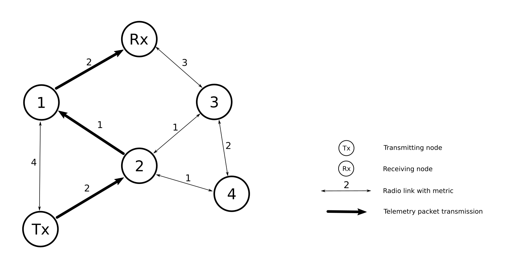

# Bluetooth Dijkstra Pathfinder 
This repository contains project files of custom Bluetooth ad - hoc mesh implementation, with Dijkstra's as routing algorithm.

In folder dijkstra\_shortest\_path is my implementation of Dijkstra's shortest 
path algorithm. It does work, although there is still a lot of room for improvements. 
Algorithm was tested on examplary graph: 

In folder zephyr\_project You can find Zephyr project files. Destination platform
of this project is nRF52840 Dongle with Zephyr RTOS. For now it is tested on 
Renode platform.

Default Dijkstra graph used in zephyr version is:
<pre>
(1)    2   (2)
  
   1       4
         
(1)    0   (2)
</pre>

In brackets are distances between nodes and without brackets are nodes addresses. 
This information is contained in graph.c file in initialization function.
This setup allows for simplest case where shortest path must be found. Solution to reach
node 2 from node 0 is path through 0, 1, 2 with total distance of 2.

To build the project, go to zephyr-rtos directory and run build command:
> cd zephyr-rtos 
> west build -b nrf52840dk_nrf52840 

Then go back to the root of the project and build mobile broadcaster:
> cd ../mobile_broadcaster
> west build -b nrf52840dk_nrf52840 

Now You should be ready to run a project. File named init.resc in project root
directory is for simulation with Renode and should be run with it (use Renode 
built from sources):
> ./renode ~/path/to/init.resc

